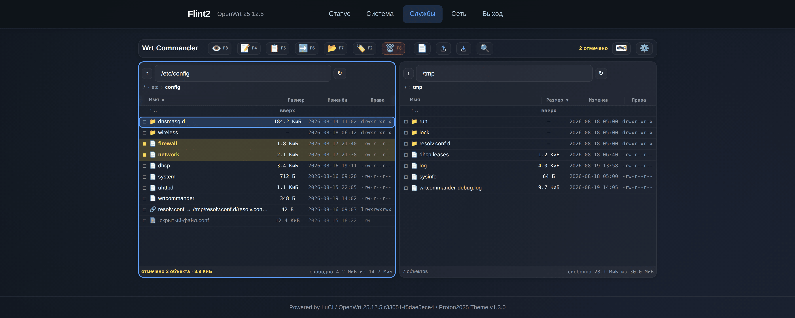
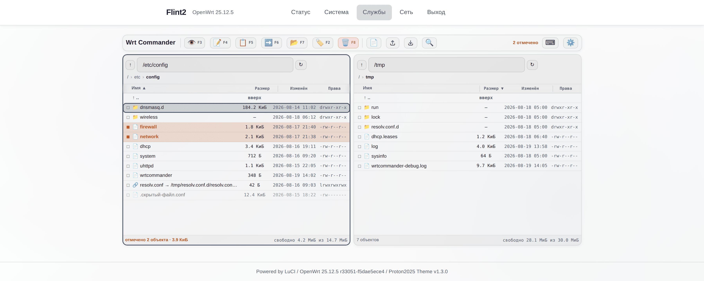
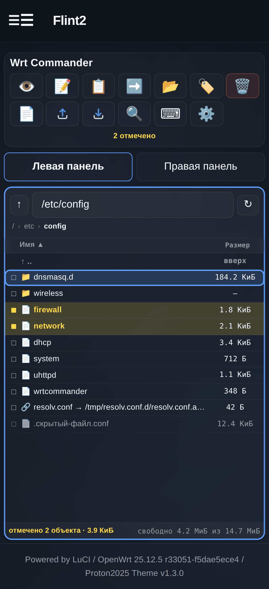
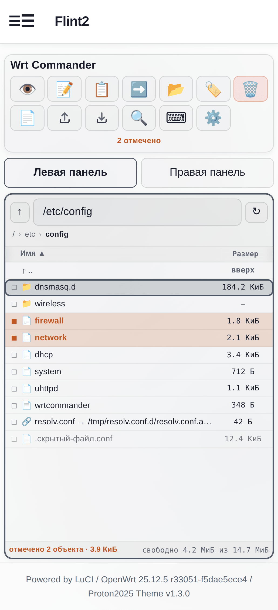
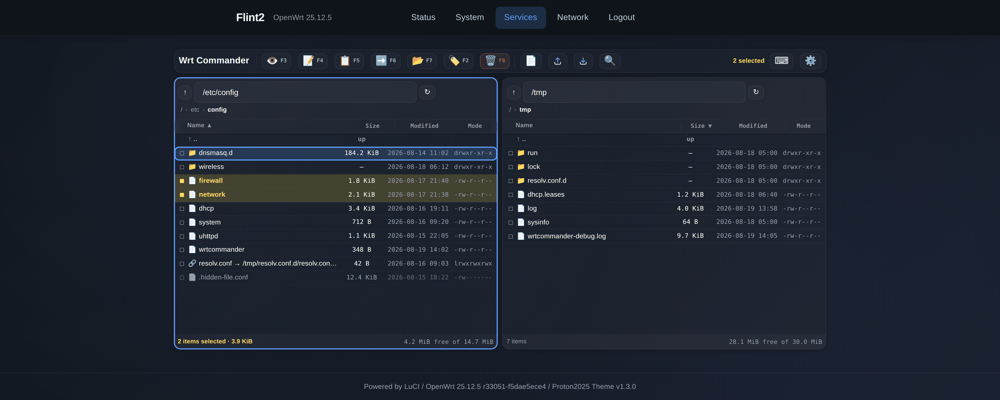
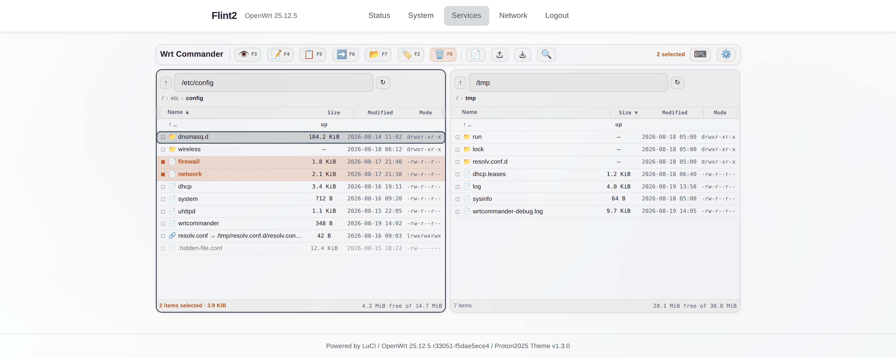
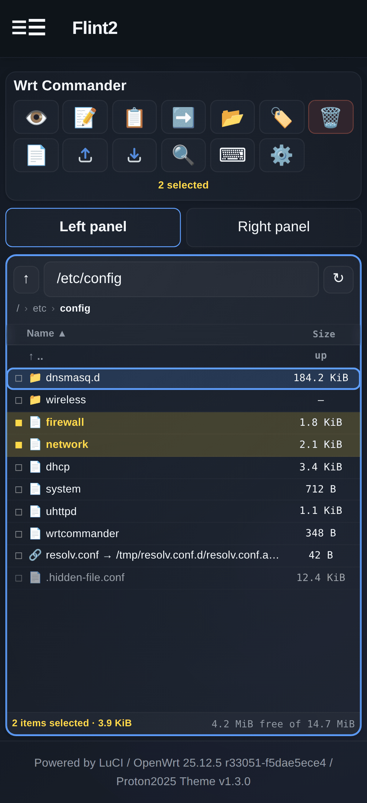
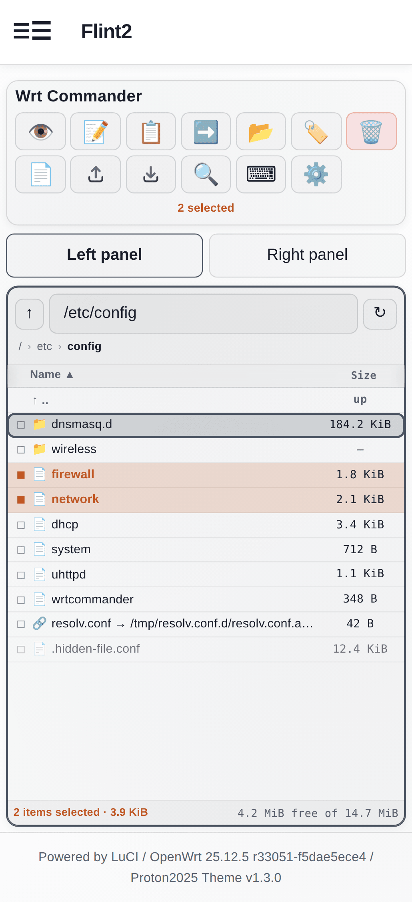

# Wrt Commander

**Русский** · [English](#wrt-commander-english)

**Пакет:** `luci-app-wrtcommander` — в LuCI отображается как **Wrt Commander**.

Полноценный файловый менеджер для LuCI на OpenWrt, рассчитанный на
администратора. **Это runtime-редакция для разработки**, описанная в
техническом задании: готовое рабочее приложение, которое копируется на
работающий роутер OpenWrt 25.12.x и сразу используется — без пакетного
менеджера, без `.ipk`, без SDK и тулчейна.

## Что это

**Двухпанельный commander** — раскладка, которую сделали стандартом
Norton / Midnight / Total Commander: две независимые панели каталогов
рядом, одна из них активная, и любая операция по умолчанию идёт «из
активной панели в противоположную».



<details>
<summary><b>Светлая тема и вид на телефоне</b></summary>

<br>



<p align="center">
  
  
</p>

</details>

<sub>Снимки сделаны на настоящей таблице стилей Proton2025 и разметке
приложения, с примерным содержимым каталогов.</sub>

- Две панели с независимыми путём, сортировкой и выделением; **Tab**
  переключает, активная обведена рамкой
- **F5 Копировать / F6 Переместить по умолчанию целятся в каталог
  соседней панели** — ради этого две панели и нужны
- Полное управление с клавиатуры: стрелки, PageUp/Down, Home/End, Enter
  для открытия, Backspace на уровень выше, Insert/Space для отметки,
  Ctrl+A, Ctrl+R
- Каждое действие продублировано иконкой в шапке, так что клавиатура
  не обязательна
- Строка состояния у каждой панели: число объектов, размер выделенного,
  свободное место на этой файловой системе
- Создание / переименование / удаление / копирование / перемещение,
  одного объекта или сразу многих
- Потоковая загрузка и скачивание по HTTP (никогда не base64 через JSON)
- Просмотрщик и редактор текста с атомарным сохранением и обнаружением
  конфликта
- Правка прав доступа (chmod) и владельца/группы (chown)
- Поиск по имени файла, в текущем каталоге или рекурсивно, с лимитами
- **Английский и русский** через штатный конвейер gettext/`.lmo` LuCI
- Единственный обязательный слой проверки путей, общий для всех
  операций, написанный так, чтобы устоять против `../`, кодированного
  обхода и побега через симлинк (см. **Модель безопасности**)

На телефоне две панели не помещаются, поэтому ниже 900px приложение
показывает по одной панели с переключателем. Сама *модель* панелей не
меняется, поэтому «скопировать в соседнюю панель» означает ровно то же,
что и на десктопе.

## Требования

- OpenWrt 25.12.x (должно работать и на 23.05/24.10 — использованные
  здесь API ubus/rpcd/ucode стабильны на всех этих выпусках)
- LuCI (представления на JS, то есть любой современный LuCI)
- `rpcd` с `rpcd-mod-ucode` (даёт загрузчик плагинов
  `/usr/share/rpcd/ucode`)
- `ucode` (сам интерпретатор)
- `uhttpd`
- `luci-lua-runtime` — нужен **только** для загрузки/скачивания
  (см. ниже); всё остальное (просмотр, правка, удаление, копирование,
  перемещение, права, поиск) работает без него

Всё перечисленное — штатные части любого роутера, где уже работает
стоковый LuCI, так что на обычной прошивке доставлять нечего, кроме
`ucode`/`rpcd-mod-ucode`, если образ необычно урезанный.

## Архитектура

```
Представление LuCI JS (www/luci-static/resources/view/wrtcommander.js)
        |
        |-- ubus/rpcd  ------------------->  usr/share/rpcd/ucode/wrtcommander.uc
        |     (list, stat, read, write,        ubus-объект "luci.wrtcommander"
        |      mkdir, create, rename,           - каждый метод проходит через
        |      remove, copy, move, chmod,         canon() прежде, чем тронуть
        |      chown, search, disk_info,          файловую систему (см. ниже)
        |      dirsize)
        |
        `-- обычный HTTP  ---------------->  usr/lib/lua/luci/controller/wrtcommander.lua
              (GET .../download?path=...        только потоковая передача -
               POST .../upload?dest=...)         сколь угодно большие файлы
                                                  никогда не идут через JSON/ubus
```

Всё, что разумно провести через ubus, через него и идёт. Загрузка и
скачивание — намеренное исключение: у JSON-RPC нет потоковой передачи и
есть практический потолок размера сообщения, поэтому эти две операции
работают по обычному HTTP через небольшой Lua-контроллер. Контроллер
повторяет тот же канонический конвейер проверки пути, что и ucode-бэкенд
(`canon_path()` в Lua-файле повторяет `canon()` в ucode-файле) — почему
эта логика существует в двух экземплярах и что из этого следует для
будущих правок, см. в **Известных ограничениях**.

> **Перенос пункта меню переносит и эти эндпоинты.** Приложение живёт по
> адресу `admin/services/wrtcommander`, а URL загрузки/скачивания —
> `admin/services/wrtcommander/upload` и `…/download`. Этот путь прописан
> в четырёх местах: `menu.d/luci-app-wrtcommander.json`, вызовы `entry()`
> в Lua-контроллере, вызовы `L.url(…)` в JS-представлении и два
> тестовых HTTP-скрипта. Поменяете одно — передача файлов молча
> сломается (интерфейс продолжит работать, загрузка просто получит 404),
> поэтому меняйте все четыре разом.

### Почему бэкенд на ucode, а Lua только для потоковой передачи

OpenWrt/LuCI активно уходит от Lua к ucode + rpcd для всего серверного.
Файловый бэкенд здесь написан целиком на ucode под `rpcd-mod-ucode`
(нигде нет вызова шелла со строками, пришедшими от пользователя;
единственный внешний процесс, `df`, запускается через массивную форму
`fs.popen()`, то есть `execvp()` с литеральным argv, и никогда не через
`/bin/sh -c`). Потоковая загрузка/скачивание по HTTP всё же использует
небольшой Lua-контроллер, потому что зрелый и хорошо оттестированный
multipart-парсер `luci.http` и потоковый API `setfilehandler()` — самый
безопасный способ перегонять большие файлы, не буферизуя их целиком в
ОЗУ, а переписывать это с нуля на ucode поверх сырых CGI-примитивов
`uhttpd` было сочтено худшим компромиссом по безопасности для первого
этапа. Если в образе роутера нет `luci-lua-runtime`, пострадают ровно
две функции — загрузка и скачивание; `install.sh` это проверяет и
предупреждает, а не падает.

### `src/` против `runtime/`

Каталога `src/` нет: раз ничего не компилируется и не транспилируется,
`runtime/` **и есть** исходники. Дублирование в отдельное дерево `src/`
создало бы только риск расхождения двух копий без всякой пользы —
техзадание разрешает адаптировать предложенную раскладку под реальную
архитектуру, и для интерпретируемого приложения, копируемого на целевое
устройство, это именно такая адаптация.

## Структура репозитория

```
runtime/    ровно то, что копируется на роутер (см. deploy/MANIFEST)
deploy/     install.sh / uninstall.sh / restart.sh / MANIFEST
po/         переводы: шаблон .pot, исходники .po, сборка и проверка
tests/      набор тестов для запуска на роутере (функциональные,
            безопасность, загрузка, скачивание, редактор) + генератор
            тестовой файловой системы
README.md   этот файл
```

## 📦 Установка на роутер

Два пути. Скриптом — быстрее и он сам всё проверяет; вручную — если
удобнее копировать файлы по одному.

### ⚡ Вариант A — скриптом

**💻 На рабочей машине**

```sh
scp -r runtime deploy root@ROUTER:/tmp/wrtcommander/
ssh root@ROUTER
```

**🖥 На роутере**

```sh
cd /tmp/wrtcommander/deploy
sh install.sh
```

Что делает `install.sh`:

| | шаг |
|---|---|
| 🔒 | отказывается работать не от root |
| 🔍 | проверяет, что это OpenWrt с `ubus`, `rpcd`, `ucode` и LuCI; предупреждает (но не прерывается), если нет `luci-lua-runtime` |
| 🧪 | разбирает ucode-бэкенд и прерывается **до того, как тронет рабочую установку**, если разбор не удался |
| 📄 | копирует каждый файл из `deploy/MANIFEST` по его абсолютному пути, не трогая существующий `/etc/config/wrtcommander` (если не передать `--force-config`) |
| 🧹 | удаляет прежнюю установку FileXplorer по точным путям и переносит её конфиг на новое имя |
| 🔄 | перезагружает `rpcd` и чистит кэш индекса LuCI |
| ✅ | проверяет, что `luci.wrtcommander` появился в `ubus list` |

`uhttpd` намеренно не перезапускается: статика и Lua-контроллер
подхватываются на следующем запросе.

### 🛠 Вариант B — вручную через scp

**🖥 На роутере — до копирования** (каталог новый, иначе `scp` упадёт):

```sh
mkdir -p /www/luci-static/resources/wrtcommander
```

**💻 На рабочей машине** — из каталога `runtime/`:

```sh
cd runtime
scp etc/config/wrtcommander                                 root@ROUTER:/etc/config/wrtcommander
scp usr/share/rpcd/ucode/wrtcommander.uc                    root@ROUTER:/usr/share/rpcd/ucode/wrtcommander.uc
scp usr/share/rpcd/acl.d/luci-app-wrtcommander.json         root@ROUTER:/usr/share/rpcd/acl.d/luci-app-wrtcommander.json
scp usr/share/luci/menu.d/luci-app-wrtcommander.json        root@ROUTER:/usr/share/luci/menu.d/luci-app-wrtcommander.json
scp usr/lib/lua/luci/controller/wrtcommander.lua            root@ROUTER:/usr/lib/lua/luci/controller/wrtcommander.lua
scp usr/lib/lua/luci/i18n/wrtcommander.ru.lmo               root@ROUTER:/usr/lib/lua/luci/i18n/wrtcommander.ru.lmo
scp www/luci-static/resources/view/wrtcommander.js          root@ROUTER:/www/luci-static/resources/view/wrtcommander.js
scp www/luci-static/resources/wrtcommander/wrtcommander.css root@ROUTER:/www/luci-static/resources/wrtcommander/wrtcommander.css
```

Или одной командой:

```sh
cd runtime && tar cf - . | ssh root@ROUTER "mkdir -p /www/luci-static/resources/wrtcommander && tar xf - -C /"
```

**🖥 На роутере — после копирования.** 🧹 Уборка прежней установки здесь
**обязательна**: при копировании вручную она не выполняется сама, а
старые файлы лежат по другим путям, поэтому на роутере окажутся два
приложения сразу — со своими ubus-объектом, ACL и пунктом в «Службах».

```sh
# перенести настройки со старого имени, если они правились
[ -f /etc/config/filexplorer ] && cp /etc/config/filexplorer /etc/config/wrtcommander

# убрать прежнюю установку - точные пути, без масок
rm -f /usr/share/rpcd/ucode/filexplorer.uc \
      /usr/share/rpcd/acl.d/luci-app-filexplorer.json \
      /usr/share/luci/menu.d/luci-app-filexplorer.json \
      /usr/lib/lua/luci/controller/filexplorer.lua \
      /usr/lib/lua/luci/i18n/filexplorer.ru.lmo \
      /www/luci-static/resources/view/filexplorer.js \
      /www/luci-static/resources/filexplorer/filexplorer.css
rmdir /www/luci-static/resources/filexplorer 2>/dev/null

# 🔄 перезапуск
rm -f /tmp/luci-indexcache* /tmp/luci-modulecache/*
/etc/init.d/rpcd restart
/etc/init.d/uhttpd restart
```

### ✅ Проверка

```sh
ubus list | grep wrtcommander        # ожидается luci.wrtcommander
ubus list | grep filexplorer         # ожидается пусто
ubus call luci.wrtcommander list '{"path":"/etc/config"}' | head
```

Если объект не появился — посмотрите, что скажет разбор бэкенда:

```sh
ucode /usr/share/rpcd/ucode/wrtcommander.uc
```

Затем **Ctrl+Shift+R** в браузере и **LuCI → Службы → Wrt Commander**.

### Повторное развёртывание после правок

Отредактируйте файлы в `runtime/`, скопируйте изменённые через `scp`,
затем:

```sh
sh /tmp/wrtcommander/deploy/restart.sh
```

Скрипт заново проверяет синтаксис ucode, перезагружает `rpcd` и чистит
кэш индекса — это быстрый внутренний цикл разработки.

### Удаление

```sh
sh /tmp/wrtcommander/deploy/uninstall.sh          # конфиг остаётся
sh /tmp/wrtcommander/deploy/uninstall.sh --purge   # удаляет и его
```

`uninstall.sh` трогает только те точные абсолютные пути, что перечислены
в `deploy/MANIFEST` (восемь фиксированных файлов) — он никогда не делает
удаление по маске или рекурсивно, поэтому по построению не может
добраться до пользовательских данных или посторонних файлов OpenWrt.

## Тестирование

```sh
cd /tmp/wrtcommander/tests
sh run-all.sh
```

Скрипт строит одноразовое тестовое дерево в `/tmp/wrtcommander-test/`
(имена в Unicode, пробелы, скрытые файлы, большой файл, симлинки, в том
числе намеренно битый) и запускает по порядку:

- `fs-tests.sh` — create, mkdir, list, stat, read, write, rename, copy,
  move, delete, chmod, search, disk_info; Unicode, пробелы, скрытые
  файлы, длинные имена, симлинки
- `dirsize-tests.sh` — подсчёт размера каталога: сумма по дереву с
  известными размерами, симлинки не разыменовываются (в том числе петля
  на самого себя), упор в лимиты по числу записей и глубине, отказ на
  обычном файле, отказ на обходе пути
- `security-tests.sh` — временно ограничивает `allowed_root` тестовым
  деревом, после чего проверяет, что `../`, `../../`, побег по
  абсолютному пути, буквальные `%2e%2e` / `%252e%252e` (доказывая
  отсутствие двойного декодирования), обратные слэши и побег по симлинку
  (прямой и вложенный) отвергаются в *каждом* изменяющем методе, а не
  только в `list`/`stat`; исходный `allowed_root` восстанавливается на
  выходе, даже если тест упал
- `editor-tests.sh` — пустой файл, текст UTF-8/русский, JSON, конфиг в
  стиле UCI, отказ на слишком большом файле, обнаружение внешнего
  изменения и поведение чтения/записи в `/rom` (слой overlay только для
  чтения)
- `upload-tests.sh` / `download-tests.sh` (нужен `curl`) — пустые,
  маленькие, с Unicode-именем, с пробелами в имени и большие
  (многомегабайтные, потоковые) файлы; защита от перезаписи; отказ на
  запись в `/rom`; 404 на несуществующем пути; скачивание через симлинк;
  отказ на скачивание каталога

Каждый этап печатает `PASS`/`FAIL` по каждой проверке и итоговый счёт;
`run-all.sh` завершается с ненулевым кодом, если что-то упало.

Две вещи намеренно **не** моделируются, и обоснование оставлено прямо в
скриптах: инъекция буквального NUL-байта (аргументы `ubus call` — это
C-строки, протолкнуть NUL через CLI попросту нечем; бэкенд всё равно
защищается от такого от сырого клиента ubus/JSON-RPC) и классический
«отказ в доступе» по владельцу/группе (rpcd работает от root, что по
определению обходит биты прав Unix — реалистичный сценарий «в записи
отказано» для привилегированного инструмента такого рода — это
файловая система только для чтения, то есть `/rom`).

## API бэкенда (ubus-объект `luci.wrtcommander`)

| Метод | Назначение |
|---|---|
| `list` | содержимое каталога (имя, тип, размер, mtime, права, владелец, группа, цель симлинка) |
| `stat` | полные метаданные одного пути плюс сведения о точке монтирования |
| `read` | предпросмотр/правка/начало/конец файла, base64, с ограничением по размеру |
| `write` | атомарное сохранение (временный файл + rename) с проверкой конфликта по mtime/размеру |
| `mkdir` / `create` | новый каталог / новый пустой файл |
| `rename` | переименование внутри того же каталога |
| `remove` | рекурсивное удаление, один или много путей, результат по каждому |
| `copy` / `move` | рекурсивно, один или много объектов; `move` использует `rename()`, когда это возможно, и откатывается к копированию с удалением между файловыми системами |
| `chmod` / `chown` | изменение прав / владельца |
| `search` | поиск по имени, в текущем каталоге или рекурсивно, с лимитами по глубине, просмотренному и числу результатов |
| `disk_info` | свободно/занято/всего для файловой системы под путём, через `df` (никогда не рекурсивный `du`) |
| `dirsize` | размер каталога по запросу: сумма по всему поддереву, с лимитами (см. **Размеры каталогов**) |

Каждый ответ — либо `{"ok": true, ...}`, либо `{"ok": false, "error":
{"code": "EACCES", "message": "..."}}`; `remove`/`copy`/`move` всегда
отвечают конвертом верхнего уровня `ok: true` и массивом `results: [...]`
с результатом по каждому объекту, поскольку групповая операция может
пройти частично.

## ACL

`usr/share/rpcd/acl.d/luci-app-wrtcommander.json` определяет отдельные
области — `luci-app-wrtcommander-read`, `-write`, `-delete`, `-chmod`,
`-chown` — плюс `luci-app-wrtcommander`, который нужен пункту меню и
сессии администратора с полным доступом. Сессии root/admin в LuCI
получают все области автоматически (штатный вход `root` в OpenWrt даёт
`read '*'` / `write '*'`); ограниченный пользователь LuCI получает
только то, что вы явно назначили в `/etc/config/rpcd`. Загрузка и
скачивание проверяются в самом Lua-контроллере — он спрашивает у rpcd,
есть ли у текущей сессии доступ `ubus`/`luci.wrtcommander`/`list`
(чтение) или `write`, прежде чем тронуть файловую систему, — а не
прятанием кнопки.

## Модель безопасности

```
Представление LuCI JS
     |
     v
ubus / HTTP           <- сюда приходит недоверенный ввод
     |
     v
проверка ACL           (rpcd либо session_has_access() в Lua-контроллере)
     |
     v
canon()                 ЕДИНСТВЕННЫЙ слой проверки пути:
     |                     нормализация (разбор "." и ".." лексически,
     |                      без обращения к файловой системе)
     |                   -> проверка вложенности в allowed_root
     |                   -> разыменование симлинков для существующей
     |                      части пути через realpath()
     |                   -> повторная проверка вложенности уже для
     |                      разыменованного пути
     v
системный вызов POSIX    (модуль fs в ucode / io+nixio в Lua — никогда шелл)
```

Ни один метод в `wrtcommander.uc`, влияющий на файловую систему, и ни одно
HTTP-действие в `wrtcommander.lua` не трогают путь, который не пришёл из
этой функции. Конкретно вот что покрыто в `security-tests.sh`:

- `../`, `../../`, глубокий обход `../../../`
- побег по абсолютному пути (`/etc/passwd`, когда `allowed_root`
  ограничен поддеревом)
- буквальные `%2e%2e` и дважды кодированные `%252e%252e` трактуются как
  обычные (несуществующие) имена файлов, что доказывает: бэкенд не
  выполняет собственного декодирования, которым можно было бы
  воспользоваться через двойное кодирование
- последовательности с обратным слэшем (в Linux это не разделитель пути,
  так что просто часть имени)
- симлинк внутри разрешённого корня, указывающий наружу (прямой и
  вложенный на один каталог)
- та же проверка вложенности применяется к каждому изменяющему методу
  (`write`, `remove`, `mkdir`, `chmod`, …), а не только к `list`/`stat`
- удаление и переименование самого разрешённого корня запрещены наотрез

Другие намеренные решения: загрузка и скачивание никогда не буферизуют
файл целиком в ОЗУ (везде фиксированные куски по 64 КиБ); `read()`
применяет `preview_max_size`/`editor_max_size` на стороне сервера
независимо от того, что заявляет клиент; `search()` ограничен
максимальной глубиной, числом просмотренных каталогов и числом
результатов, так что запрос никогда не превратится в безграничный
`find /`; специальные файлы (устройства, FIFO, сокеты) никогда не
«копируются» молча — попытка скопировать такой файл даёт жёсткую явную
ошибку, а не битую или вводящую в заблуждение копию; `disk_info`
использует `df`, а не рекурсивный `du`; листинг каталога никогда не
считает рекурсивный размер папок.

## Настройки (`/etc/config/wrtcommander`)

```
config wrtcommander 'main'
	option enabled '1'
	option allowed_root '/'
	option show_hidden '1'
	option preview_max_size '524288'      # 512 КиБ
	option editor_max_size '1048576'      # 1 МиБ
	option search_max_results '500'
	option search_max_depth '12'
	option search_max_scanned '20000'
	option dirsize_max_entries '50000'
	option dirsize_max_depth '24'
	option debug '0'
```

`allowed_root` читается заново при каждом вызове, поэтому бэкенд уже
архитектурно готов к будущему развёртыванию вида «ограничить
`/mnt/storage`» — фронтенд никогда не применяет и даже не знает эту
политику, он лишь отражает то, что сообщают `list`/`stat`.

### Режим отладки

```sh
uci set wrtcommander.main.debug='1'
uci commit wrtcommander
sh deploy/restart.sh
tail -f /tmp/wrtcommander-debug.log
```

Каждая строка фиксирует метод, путь, длительность и успех/неудачу —
**никогда** содержимое файлов, учётные данные или тела запросов.

## Заметки по интерфейсу

Представление на JS (`wrtcommander.js`) использует только собственный
фреймворк LuCI (`ui`, `dom`, `rpc`, `E()`), Unicode-глифы в качестве
иконок плюс одну нарисованную пару inline-SVG (никаких иконочных
библиотек) и сопутствующую таблицу стилей (`wrtcommander.css`).

Раскладка сверху вниз: одна строка шапки, затем две панели.

В шапке — название приложения, затем каждое действие иконкой: функциональные
клавиши (F3 Просмотр, F4 Правка, F5 Копировать, F6 Переместить, F7 Новая
папка, F2 Переименовать, F8 Удалить) с обозначением клавиши рядом с
иконкой, затем действия без функциональной клавиши (Новый файл,
Загрузить, Скачать, Поиск), и наконец, прижатые вправо, счётчик
выделения и две кнопки уровня страницы (Горячие клавиши, Настройки).
У каждой кнопки есть `title` и `aria-label` с полной формулировкой,
поэтому иконки подписаны и для наведения, и для скринридеров.

Глифы подбирались отрисовкой кандидатов на каждое действие в размер
кнопки и сравнением, а не по названиям код-поинтов. Два результата стоит
зафиксировать: глазу нужен селектор варианта `U+FE0F`, чтобы сохранить
цвет, а клавиатуре (`U+2328`) он, наоборот, противопоказан — с ним она
рисуется блёклой.

Загрузка и Скачивание — исключение и единственная пара, которая обязана
читаться как комплект: один и тот же лоток с зеркальной стрелкой.
Эмодзи-пары с таким поведением нет: лотки «исходящие/входящие»
(`U+1F4E4`/`U+1F4E5`) различаются только направлением маленькой стрелки
и рядом читаются как одна и та же иконка дважды, а стрелки в рамке
(`U+2B06`/`U+2B07`) — честная пара, но единственные плоские плитки в
ряду пиктограмм. Поэтому эти две нарисованы функцией `trayIcon()` в
представлении: inline-SVG, никакой иконочной библиотеки, один общий путь
лотка и зеркальная стрелка. Обводка использует `currentColor`, стрелка —
`--fx-accent`, так что обе темы обслуживаются без второй палитры. SVG
задан в `1em` *внутри* `.fx-act-ico`, у которого уже `1.35em`: если
задать размер в `em` ещё и там, множители перемножатся и эти две кнопки
станут выше остального ряда.

Счётчик выделения показывается, только когда что-то действительно
отмечено, и считает отмеченные записи, а не строку, на которой оказался
курсор.

### Диалоги

**Горячие клавиши** — сетка в две колонки шириной ровно по содержимому и
по центру диалога: клавиши прижаты вправо к средней линии, описания
начинаются сразу за ней, всё сгруппировано на Навигацию / Выделение /
Действия с файлами. Она заменила таблицу во всю ширину с колонкой клавиш
в 40%, из-за которой между клавишей и тем, что она делает, оставалась
полоса пустоты.

**Настройки** намеренно короткие — именно в настройках опции и
разрастаются. Там только то, что меняет чтение списка или стартовое
состояние панелей, по одному переключателю на пункт: показывать скрытые
файлы, папки в начале, запоминать пути панелей, сбросить ширину
столбцов, переносить длинные строки в редакторе. Всё, что относится к
конкретному файлу (права, например), живёт на этом файле.

Замечание о том, где это рисуется: модалки LuCI добавляются в `<body>`,
и контекстное меню тоже. Значит, они оказываются *вне* `.fx-app`, где
раньше объявлялись токены `--fx-*`, — и ни один из них не
разрешался. Замер до починки: клавиши без рамки и фона, линейки разделов
шириной 0px, приглушённые подсказки полным контрастом, контекстное меню
без рамки и с прямыми углами. Теперь блок токенов объявлен и на `:root`,
а `.fx-app` и `.fx-ctx` повторяют его, чтобы тема, объявляющая свои
`--proton-*` ниже `:root`, всё равно подхватывалась локально.

### Оформление

Таблица стилей написана под пользовательские CSS-свойства темы
[Proton2025](https://github.com/ChesterGoodiny/luci-theme-proton2025) —
`--proton-bg-tertiary`, `--proton-accent`, `--proton-radius`,
`--proton-shadow-sm` и так далее — у каждого есть цепочка запасных
значений, заканчивающаяся нейтральным серым. На этой теме приложение
наследует её поверхности, акцент, скругления и тени и бесплатно
поддерживает светлый режим, потому что светлый режим там лишь
переназначает те же переменные. На любой другой теме запасные значения
сохраняют читаемость. Палитра нигде не зашита.

**Подгонка под дисплей.** Двум панелям файлов нужно больше места, чем
форме настроек, поэтому представление забирает то, что реально есть у
окна, в два независимых шага.

*Высота* растягивается так, чтобы панели доставали до низа окна, а не
исходили из фиксированной догадки о высоте шапки и подвала темы.

*Ширина* ослабляет max-width собственного контейнера темы
(`#maincontent`) через класс `.fx-wide`, и только пока открыта эта
страница. Само приложение никогда не двигается и не меняет размер —
контейнер сохраняет своё центрирование, отступы и смещение под сайдбар,
— а `widenContainer()` вешает класс, замеряет и тут же снимает его, если
контейнер перестал помещаться в окно.

Цель — `max(var(--proton-page-max-width, 990px), 67.5%)`: примерно две
трети окна, чтобы панели получили реальное место, но строка с именем
файла не растянулась в неудобно длинную для чтения, и никогда не ниже
собственного лимита темы, так что на маленьком экране это может только
добавить места, но не отнять. Замер на Proton2025:

| viewport | было | стало |
|---------:|-----:|------:|
| 1920 | 990 | 1296 |
| 1600 | 990 | 1080 |
| 1366 | 990 | 990 |
| 1280 | 990 | 990 |
| 1024 | 990 | 990 |

С 1366 и ниже работает нижняя граница, поэтому собственная ширина темы
остаётся нетронутой. Горизонтального скролла нет ни на одном из этих
размеров, ни на 414/360, где шапка вместо этого переносится.

Проверка с откатом — не украшение. В Proton2025 `#maincontent` — это
flex-элемент, который дорастает до места, удерживаемого лимитом, поэтому
поднятие лимита просто работает. Классическая тема с сайдбаром вместо
этого сочетает `width: 100%` с левым margin для меню, и там то же
правило может вытолкнуть правый край за экран — тогда класс снимается и
тема остаётся при своей ширине. Ранние версии пытались расширять само
приложение (CSS `100vw` с отрицательным margin, затем позиция,
вычисленная из замеров), и обе выпускали раскладку, уезжавшую за край
экрана на живом роутере, — поэтому эта версия меняет одно свойство
контейнера темы и проверяет результат, а не верит ему.

### Размеры каталогов

У каталога нет собственного размера — число, которое хочется видеть в
этом столбце, это сумма по всему поддереву, а она стоит полного обхода.
Заполнять столбец автоматически означало бы обходить всю файловую
систему по разу на каждую видимую папку при каждом открытии каталога, на
устройстве с 32–128 МБ ОЗУ и медленной флешкой. Листинг `/` полез бы в
`/proc` и `/sys`, где размеры фиктивны, а часть файлов блокируется при
чтении, и в каждый примонтированный USB-диск.

Поэтому работает как в Midnight Commander: столбец показывает прочерк,
пока не спросили, а **Ctrl+Space** (или *Посчитать размер* в контекстном
меню) считает его для отмеченных папок или для той, что под курсором.
Ответ заменяет заглушку в столбце и держится до перезагрузки этой
панели. Несколько папок обходятся одна за другой, а не разом, чтобы rpcd
роутера никогда не выполнял несколько обходов файловой системы
параллельно.

У метода `dirsize` три ограничения, все намеренные:

- **`lstat`, никогда `stat`** — симлинк считается ссылкой и никогда не
  разыменовывается, что исключает петли симлинков и любой побег из
  разрешённого корня на середине дерева.
- **Границы устройств не пересекаются**, как ведёт себя `du -x`, —
  именно это удерживает обход от `/` в стороне от `/proc`, `/sys` и
  примонтированного USB-диска. Спросить размер самой точки монтирования
  по-прежнему можно, потому что тогда обход стартует именно с этого
  устройства.
- **Лимиты на число посещённых записей и на глубину**
  (`dirsize_max_entries`, `dirsize_max_depth`). Упор в любой из них
  останавливает обход и выставляет `truncated`; столбец тогда показывает
  `>` перед числом и сообщает в подсказке, что папка слишком велика для
  полного измерения, — нижняя граница подаётся как нижняя граница, а не
  частичная сумма как ответ.

Нечитаемый подкаталог пропускается, а не рушит весь обход, потому что
сессия не от root на такие наткнётся; их количество возвращается в
`unreadable`. Итог — видимый размер (apparent size), как и в столбце для
файлов, а значит жёсткие ссылки считаются по разу на каждую ссылку.

Одну вещь стоит зафиксировать, потому что она невидима и была поймана
только прогоном обхода по дереву с известными размерами: `fs.lstat()`
сообщает устройство **объектом** `{ major, minor }`, а не числом.
Сравнение двух таких через `!=` сравнивает идентичность объектов и всегда
истинно, поэтому первая версия считала каждый подкаталог другой файловой
системой, никуда не спускалась и выдавала за итог только файлы верхнего
уровня. Это покрыто в `tests/dirsize-tests.sh`.

### Столбцы

«Размер», «Изменён» и «Права» отцентрованы каждый в своём столбце — и
заголовок, и значения, — так что каждый читается как подписанный блок, а
не как текст, притиснутый к соседу. Пока размер папки не посчитан, в
столбце стоит прочерк `—`, тот же, что `fmtSize()` возвращает для
неизвестного размера: столбец лучше промолчит, чем напишет туда
не-размер.

Ширины столбцов перетаскиваются. У каждого из трёх есть ручка на левом
крае в строке заголовка; перетаскивание расширяет или сужает этот
столбец, а столбец «Имя» забирает разницу. Двойной клик по ручке
возвращает столбцу значение по умолчанию. Ширины хранятся
CSS-переменными на корне приложения, а не на ячейках, поэтому одно
перетаскивание двигает столбец в *обеих* панелях и все строки следуют за
ним без перерисовки, и они запоминаются в `localStorage` между
посещениями.

Две вещи, которые здесь надо было сделать правильно: `.fx-th` не должен
использовать общий переход `all .2s`, иначе ячейка заголовка анимирует
свой flex-basis и отстаёт от курсора на пятую долю секунды, пока строки
под ней идут за ним точно; и каждое перетаскивание зажато в минимум и
максимум для своего столбца, чтобы никаким перетаскиванием нельзя было
схлопнуть столбец «Имя».

### Контекстное меню

Правый клик — полноценная замена шапке и клавиатуре, а не подмножество.
В нём Открыть / Просмотр / Правка / Скачать, Копировать / Переместить /
Переименовать / Удалить, Посчитать размер, Отметить / Отметить всё /
Снять отметки, Новый файл / Новая папка / Загрузить, Права доступа /
Свойства и Поиск / Обновить, причём у каждого пункта показана та же
клавиша, которой он вызывается из шапки.

К каким записям применяется действие — по тому же правилу, что и у
функциональных клавиш: явное выделение важнее, а строка под кликом
используется, только если ничего не отмечено. Правый клик по строке
*вне* выделения действует на одну эту строку. Поэтому «отметить три,
щёлкнуть правой по одной из них, Удалить» означает все три, и меню это
говорит: пункты, работающие со многими объектами, подписаны количеством.

Меню открывается и на пустом месте под строками — там пропадают
пофайловые пункты и остаются те, что действуют на каталог.

Меню добавляется в `<body>`, чтобы вырваться из обрезки переполнения
панелей, а значит рисуется *вне* `.fx-app` и не разрешало ни одного из
токенов `--fx-*`: у него не было рамки, были прямые углы и невидимые
разделители. Поэтому блок токенов объявлен на `.fx-app, .fx-ctx` (и на
`:root`, см. **Диалоги**).

### На телефоне

Ниже 900px две панели превращаются в одну с переключателем, а шапка
меняет форму, а не просто переносится. Она становится сеткой из семи
колонок, которая делит 13 кнопок ровно на два ряда во всю ширину, 7 и 6.
Оставленная переноситься сама по себе, она давала три рваных ряда —
намерено 5+6+2 на 412px и 4+5+4 на 360px. Заголовок занимает строку
выше, счётчик выделения — строку ниже, оба размещены через `order`, а не
позицией в разметке: счётчик стоит между «Поиск» и двумя кнопками уровня
страницы, и оставленный там он ломал бы поток иконок на третий ряд
каждый раз, когда что-то отмечено.

Подписи функциональных клавиш на этой ширине скрыты. У телефона нет
F-клавиш, и именно отказ от подписи позволяет семи иконкам уместиться в
ряд шириной 360px.

Страница также забирает обратно боковые поля темы в 16px, урезая их до
6px: 32px на экране 360px — почти десятая часть, а списку файлов ширина
нужнее, чем поля. Это правило тоже живёт внутри `#maincontent.fx-wide`,
поэтому тот же предохранитель, который умеет снять класс, снимает и его.

Урезать отступы само по себе мало, потому что тема может оставить и сам
контейнер уже экрана — на телефоне он показывался в 77% ширины окна,
прижатым влево, с полосой пустоты вдоль правого края. Какое свойство это
вызывает — разнится (`max-width`, авто-margin, процентная ширина), и
стилями это не предугадать, поэтому `stretchContainer()` не пытается его
опознать. Ниже 900px он замеряет контейнер; если впустую пропадает
больше небольшого зазора, он нейтрализует `max-width`, `width` и оба
margin разом, замеряет снова и возвращает все четыре обратно, если
результат не стал одновременно шире прежнего и полностью на экране.
Раскладка, которой это не подходит, остаётся при своей геометрии — тот
же контракт, что у `.fx-wide`. Десктоп исключён целиком: там контейнер
*должен* быть уже окна, и сколько от этого забрать, уже решает
`.fx-wide`.

Правило `max-width` у `.fx-wide` ограничено `min-width: 901px` по той же
причине: ниже контейнер должен просто использовать экран, и наш лимит
там был бы ещё одной вещью, с которой замеру пришлось бы спорить.

Соглашения commander'ов, которые стоит знать:

- **Курсор и выделение — разные вещи.** Курсор — это обведённая строка,
  которую вы двигаете стрелками; выделение — это то, что вы отмечаете
  через Insert/Space или квадратик `□`. Действие при пустом выделении
  применяется к строке под курсором — именно это делает работу с одним
  файлом быстрой.
- Пути панелей, порядок сортировки, активная панель, видимость скрытых
  файлов и «папки в начале» сохраняются в `localStorage`.
- Разрушающие действия перечисляют ровно те пути, которых коснутся, и
  добавляют более громкое предупреждение, если среди них есть системный
  путь (`/etc`, `/overlay`, `/rom`, `/usr`, `/lib`, `/bin`, `/sbin`,
  `/boot`, `/www`) — это только подсказка интерфейса; бэкенд применяет
  настоящие правила независимо от того, что интерфейс показывает или
  прячет.

## Языки

Интерфейс полностью переведён на **английский и русский** штатным
конвейером gettext в LuCI, поэтому следует за тем языком, на который
настроен сам LuCI:

```sh
uci set luci.main.lang=ru
uci commit luci
```

или **Система → Система → Язык**. При `lang=auto` LuCI следует за
`Accept-Language` браузера.

Скомпилированный каталог устанавливается в
`/usr/lib/lua/luci/i18n/wrtcommander.ru.lmo`. Учтите, что он переводит
*Wrt Commander*; чтобы окружающий интерфейс LuCI тоже был русским, нужен
собственный каталог LuCI (`luci-i18n-base-ru`) — `install.sh`
предупреждает, если его нет.

**Пункт меню тоже проходит через каталог**, хотя и разрешается в
«Wrt Commander» на любом языке: имя продукта — это имя, а не описание,
поэтому оно не переводится. Заголовки меню используют тот же каталог,
что и всё остальное (апстримные приложения указывают `menu.d/…json`
источником msgid своего заголовка), поэтому строка лежит в `po/` рядом с
прочими, и `po/extract.py` подхватывает её из
`menu.d/luci-app-wrtcommander.json` автоматически.

Исходники, инструменты и инструкция по добавлению языка — в
[`po/README.md`](po/README.md). Русский использует правильные три формы
множественного числа (`1 объект / 2 объекта / 5 объектов`) через `N_()`.

## Известные ограничения (первый этап)

- **Две копии логики проверки пути.** Бэкенд на ucode и Lua-контроллер
  загрузки/скачивания реализуют `canon()`/`canon_path()` независимо,
  потому что ubus/rpcd и сырой HTTP CGI — разные среды выполнения без
  общего пути импорта. Они написаны по одному проекту и покрыты
  `security-tests.sh`/`download-tests.sh` в обоих вариантах, но будущее
  изменение политики (например, другая семантика `allowed_root`) должно
  быть внесено в оба места.
- **Нет поддержки архивов.** Распаковка и создание архивов намеренно вне
  рамок этого этапа (см. §77 техзадания), а не выпущены небезопасно
  (проблемы класса Zip Slip); «Открыть с помощью» в интерфейсе пока
  ограничено просмотром/правкой/скачиванием, при этом архитектура
  контекстного меню уже позволяет добавить действия позже.
- **Нет поддержки HTTP Range при скачивании** (нет докачки большого
  прерванного файла).
- **Не у каждой кнопки диалога есть блокировка на время запроса.**
  Большинство разрушающих действий и так проходят через подтверждающую
  модалку, которая и есть основная защита от случайной двойной отправки,
  но горстка кнопок пока не блокирует себя, пока их запрос в полёте.
- **Нет предварительной проверки свободного места перед копированием.**
  Чтобы заранее знать, поместится ли копия, потребовался бы рекурсивный
  подсчёт размера источника — ровно тот вид обхода, которого приложение
  избегает везде ради скорости на медленной флешке. Вместо этого
  `ENOSPC` показывается внятным «На устройстве не осталось места», когда
  случается, а частично записанный целевой файл удаляется, а не
  остаётся.
- **Определение двоичного файла — эвристика по NUL-байту** (того же
  класса проверка, что у `git`), а не полноценный анализ типа
  содержимого.
- **Часть функциональных клавиш — ещё и горячие клавиши браузера.**
  Представление вызывает `preventDefault()` для клавиш, которые
  обрабатывает, поэтому F3/F5/F7 не запускают поиск/перезагрузку/режим
  каретки, пока фокус на списке файлов, — но у каждого действия
  F-клавиши есть и кнопка, так что ничто не зависит от сговорчивости
  браузера.
- **Переводы поставляются предкомпилированными.** `.lmo` — двоичный
  формат, который собирает `po2lmo` из LuCI; правка `.po` здесь ни на
  что не влияет, пока каталог не пересобран (см. `po/README.md`).
- В этой сессии ещё не обкатано на живом железе OpenWrt 25.12.x — см.
  **Тестирование** и **Следующий шаг** ниже.

## Следующий шаг: превращение в настоящий пакет OpenWrt

1. Написать `Makefile` по конечному назначению каждого файла из
   `runtime/` (это почти один в один ложится на `deploy/MANIFEST`,
   который писался ровно с расчётом на такое повторное использование).
2. Объявить настоящие `DEPENDS` (`rpcd`, `rpcd-mod-ucode`, `ucode`,
   `uhttpd`, `luci-base`, `luci-lua-runtime`).
3. Перенести `/etc/config/wrtcommander` под `define Package/conffiles`,
   чтобы opkg считал его пользовательской конфигурацией при обновлениях.
4. Добавить скрипты `postinst`/`prerm`, делающие то же, что уже делают
   `install.sh`/`uninstall.sh` (перезагрузка `rpcd`, очистка кэша
   индекса), за вычетом того, что относится к ручному копированию.
5. Убрать закоммиченный `.lmo` и дать сборке производить его: подключение
   `$(TOPDIR)/feeds/luci/luci.mk` заставляет `luci.mk` компилировать
   `po/<lang>/*.po` и автоматически выпускать подпакеты
   `luci-i18n-wrtcommander-<lang>`, что и есть обычный способ поставки
   переводов. Раскладка `po/` здесь уже соответствует ожиданиям
   `luci.mk`, так что этот шаг должен быть удалением, а не переписыванием.
6. Собрать и протестировать `.ipk` с помощью OpenWrt SDK, затем прогнать
   этот же набор `tests/` на роутере, куда пакет поставлен через `opkg`,
   а не `scp`.

---

# Wrt Commander (English)

[Русский](#wrt-commander) · **English**

**Package:** `luci-app-wrtcommander` — displayed in LuCI as **Wrt Commander**.

A native, admin-grade file explorer for LuCI on OpenWrt. **This is the
runtime/development edition** described in the project brief: a
complete, working application you copy onto a running OpenWrt 25.12.x
router and use immediately, with no package manager, no `.ipk`, and no
SDK/toolchain involved. A proper OpenWrt package build is the planned
next stage, once this has been exercised on real hardware.

## What it is

A **two-pane commander**, the layout Norton/Midnight/Total Commander made
standard: two independent directory panels side by side, one of them
active, and every operation defaulting to "from the active panel to the
other one".



<details>
<summary><b>Light theme and the phone layout</b></summary>

<br>



<p align="center">
  
  
</p>

</details>

<sub>Rendered against the real Proton2025 stylesheet and the app's own
markup, with sample directory contents.</sub>

- Two panels with independent path, sorting and selection; **Tab**
  switches, the active one is outlined
- **F5 Copy / F6 Move default to the other panel's directory** — the
  reason two panels are worth having
- Full keyboard control: arrows, PageUp/Down, Home/End, Enter to open,
  Backspace to go up, Insert/Space to mark, Ctrl+A, Ctrl+R
- Every action is also an icon button in the header, so nothing depends
  on having a keyboard
- Per-panel status line: item count, selected size, free space on that
  filesystem
- Create / rename / delete / copy / move, one item or many
- Streamed HTTP upload and download (never base64-through-JSON)
- Text viewer and editor with atomic save and conflict detection
- Permissions (chmod) and owner/group (chown) editing
- Filename search, current directory or recursive, with result caps
- **English and Russian**, through LuCI's normal gettext/`.lmo` pipeline
- A single, mandatory path-validation layer shared by every operation,
  written to resist `../` traversal, encoded traversal, and symlink
  escape (see **Security model** below)

On a phone the two panels do not fit, so below 900px the app shows one
panel at a time with a switcher. The panel *model* is unchanged, so
"copy to the other panel" still means exactly what it means on desktop.

## Requirements

- OpenWrt 25.12.x (should also work on 23.05/24.10 - the ubus/rpcd/ucode
  APIs used here have been stable across those releases)
- LuCI (JS-based views, i.e. any current LuCI)
- `rpcd` with `rpcd-mod-ucode` (provides the `/usr/share/rpcd/ucode`
  plugin loader)
- `ucode` (the interpreter itself)
- `uhttpd`
- `luci-lua-runtime` - **only** needed for upload/download (see below);
  everything else (browsing, edit, delete, copy, move, permissions,
  search) works without it

All of the above are standard parts of any router that already runs
stock LuCI, so on a normal install there is nothing extra to add
except `ucode`/`rpcd-mod-ucode` if your image is unusually minimal.

## Architecture

```
LuCI JS view (www/luci-static/resources/view/wrtcommander.js)
        |
        |-- ubus/rpcd  ------------------->  usr/share/rpcd/ucode/wrtcommander.uc
        |     (list, stat, read, write,        "luci.wrtcommander" ubus object
        |      mkdir, create, rename,           - every method funnels through
        |      remove, copy, move, chmod,         canon() before touching the
        |      chown, search, disk_info,          filesystem (see below)
        |      dirsize)
        |
        `-- plain HTTP  ------------------->  usr/lib/lua/luci/controller/wrtcommander.lua
              (GET .../download?path=...        streamed upload/download only -
               POST .../upload?dest=...)         arbitrarily large files never
                                                  go through JSON/ubus
```

Everything that can reasonably go through ubus does. Upload and
download are the deliberate exception: JSON-RPC has no streaming and a
practical message-size ceiling, so those two operations use plain HTTP
against a small Lua controller instead. That controller re-implements
the same canonical path-validation pipeline as the ucode backend
(`canon_path()` in the Lua file mirrors `canon()` in the ucode file) -
see **Known limitations** for why this one piece of logic exists
twice, and what that implies for future changes.

> **Moving the menu entry moves those endpoints too.** The app lives at
> `admin/services/wrtcommander`, and the upload/download URLs are
> `admin/services/wrtcommander/upload` and `…/download`. That path is
> spelled out in four places - `menu.d/luci-app-wrtcommander.json`, the
> `entry()` calls in the Lua controller, the `L.url(…)` calls in the JS
> view, and the two HTTP test scripts. Change one and the file transfers
> break silently (the UI keeps working, uploads just 404), so change all
> four together.

### Why ucode for the backend, and Lua only for streaming

OpenWrt/LuCI is actively moving away from Lua toward ucode + rpcd for
everything server-side. The filesystem backend here is written
entirely in ucode against `rpcd-mod-ucode` (no shell exec with
user-controlled strings anywhere - the one external process it runs,
`df`, is invoked via the array form of `fs.popen()`, i.e. `execvp()`
with a literal argv, never `/bin/sh -c`). Streamed HTTP upload/download
still uses a small Lua controller because LuCI's mature, well-tested
`luci.http` multipart parser and `setfilehandler()` streaming API are
the safest way to move large files without buffering them fully in
RAM, and reimplementing that from scratch in ucode on top of raw
`uhttpd` ucode CGI primitives was judged a worse safety trade for a
first-stage deliverable. If a router's image doesn't carry
`luci-lua-runtime`, upload/download are the only two features
affected; `install.sh` checks for this and warns rather than failing.

### `src/` vs `runtime/`

There is no `src/` directory: since nothing here is compiled or
transpiled, `runtime/` **is** the source. Duplicating it into a
separate `src/` tree would only create drift risk between the two
copies with no corresponding benefit - the brief allows adapting the
suggested layout to the actual architecture, and for an interpreted,
copy-to-target app this is that adaptation.

## Repository layout

```
runtime/    exactly what gets copied onto the router (see deploy/MANIFEST)
deploy/     install.sh / uninstall.sh / restart.sh / MANIFEST
po/         translations: .pot template, .po sources, build/verify tooling
tests/      on-router test suite (functional, security, upload,
            download, editor) + test filesystem generator
README.md   this file
```

## 📦 Installing on a router

Two ways. The script is quicker and checks itself; by hand is there if
you would rather copy the files one at a time.

### ⚡ Option A — the script

**💻 On your workstation**

```sh
scp -r runtime deploy root@ROUTER:/tmp/wrtcommander/
ssh root@ROUTER
```

**🖥 On the router**

```sh
cd /tmp/wrtcommander/deploy
sh install.sh
```

What `install.sh` does:

| | step |
|---|---|
| 🔒 | refuses to run as anything but root |
| 🔍 | checks this is OpenWrt with `ubus`, `rpcd`, `ucode` and LuCI; warns (but does not abort) if `luci-lua-runtime` is missing |
| 🧪 | parses the ucode backend and aborts **before touching the live install** if it fails |
| 📄 | copies every file in `deploy/MANIFEST` to its absolute destination, leaving an existing `/etc/config/wrtcommander` alone unless you pass `--force-config` |
| 🧹 | removes a previous FileXplorer installation by exact path and carries its config over to the new name |
| 🔄 | reloads `rpcd` and clears LuCI's index cache |
| ✅ | verifies `luci.wrtcommander` is registered on `ubus list` |

It deliberately never restarts `uhttpd` — static files and the Lua
controller are picked up on the next request.

### 🛠 Option B — by hand over scp

**🖥 On the router, first** (the directory is new, or `scp` will fail):

```sh
mkdir -p /www/luci-static/resources/wrtcommander
```

**💻 On your workstation**, from `runtime/`:

```sh
cd runtime
scp etc/config/wrtcommander                                 root@ROUTER:/etc/config/wrtcommander
scp usr/share/rpcd/ucode/wrtcommander.uc                    root@ROUTER:/usr/share/rpcd/ucode/wrtcommander.uc
scp usr/share/rpcd/acl.d/luci-app-wrtcommander.json         root@ROUTER:/usr/share/rpcd/acl.d/luci-app-wrtcommander.json
scp usr/share/luci/menu.d/luci-app-wrtcommander.json        root@ROUTER:/usr/share/luci/menu.d/luci-app-wrtcommander.json
scp usr/lib/lua/luci/controller/wrtcommander.lua            root@ROUTER:/usr/lib/lua/luci/controller/wrtcommander.lua
scp usr/lib/lua/luci/i18n/wrtcommander.ru.lmo               root@ROUTER:/usr/lib/lua/luci/i18n/wrtcommander.ru.lmo
scp www/luci-static/resources/view/wrtcommander.js          root@ROUTER:/www/luci-static/resources/view/wrtcommander.js
scp www/luci-static/resources/wrtcommander/wrtcommander.css root@ROUTER:/www/luci-static/resources/wrtcommander/wrtcommander.css
```

Or in one go:

```sh
cd runtime && tar cf - . | ssh root@ROUTER "mkdir -p /www/luci-static/resources/wrtcommander && tar xf - -C /"
```

**🖥 On the router, afterwards.** 🧹 Clearing the previous installation is
**required** here: copying by hand does not run that step, and the old
files live at different absolute paths, so the router would end up with
two copies of the app registered — each with its own ubus object, ACL
scopes and entry under Services.

```sh
# carry settings over from the old name, if they were customised
[ -f /etc/config/filexplorer ] && cp /etc/config/filexplorer /etc/config/wrtcommander

# remove the previous installation - exact paths, no wildcards
rm -f /usr/share/rpcd/ucode/filexplorer.uc \
      /usr/share/rpcd/acl.d/luci-app-filexplorer.json \
      /usr/share/luci/menu.d/luci-app-filexplorer.json \
      /usr/lib/lua/luci/controller/filexplorer.lua \
      /usr/lib/lua/luci/i18n/filexplorer.ru.lmo \
      /www/luci-static/resources/view/filexplorer.js \
      /www/luci-static/resources/filexplorer/filexplorer.css
rmdir /www/luci-static/resources/filexplorer 2>/dev/null

# 🔄 restart
rm -f /tmp/luci-indexcache* /tmp/luci-modulecache/*
/etc/init.d/rpcd restart
/etc/init.d/uhttpd restart
```

### ✅ Checking it took

```sh
ubus list | grep wrtcommander        # expect luci.wrtcommander
ubus list | grep filexplorer         # expect nothing
ubus call luci.wrtcommander list '{"path":"/etc/config"}' | head
```

If the object is missing, see what the backend parse says:

```sh
ucode /usr/share/rpcd/ucode/wrtcommander.uc
```

Then **Ctrl+Shift+R** in the browser and **LuCI → Services → Wrt Commander**.

### Re-deploying after a change

Edit files under `runtime/`, `scp` the changed one(s) over, then:

```sh
sh /tmp/wrtcommander/deploy/restart.sh
```

This re-validates the ucode syntax, reloads `rpcd`, and clears the
index cache - the fast inner loop for iterating on the app.

### Uninstalling

```sh
sh /tmp/wrtcommander/deploy/uninstall.sh          # keeps your config
sh /tmp/wrtcommander/deploy/uninstall.sh --purge   # also removes it
```

`uninstall.sh` only ever touches the exact absolute paths listed in
`deploy/MANIFEST` (eight fixed files) - it never does a wildcard or
recursive delete, so it cannot reach into user data or unrelated
OpenWrt files by construction.

## Testing

```sh
cd /tmp/wrtcommander/tests
sh run-all.sh
```

This builds a disposable test tree at `/tmp/wrtcommander-test/`
(Unicode names, spaces, hidden files, a large file, symlinks including
a deliberately broken one) and runs, in order:

- `fs-tests.sh` - create, mkdir, list, stat, read, write, rename,
  copy, move, delete, chmod, search, disk_info; Unicode, spaces,
  hidden files, long names, symlinks
- `dirsize-tests.sh` - directory size: the total over a tree of known
  sizes, symlinks not followed (including one pointing at its own
  parent), the entry and depth caps, refusing a plain file, and refusing
  a traversal path
- `security-tests.sh` - temporarily restricts `allowed_root` to the
  test tree, then asserts `../`, `../../`, absolute-path escape,
  literal `%2e%2e` / `%252e%252e` (proving there is no double-decode),
  backslash sequences, and direct/nested symlink escape are all
  rejected on every mutating method, not just `list`/`stat`; restores
  the original `allowed_root` on exit even if a test fails
- `editor-tests.sh` - empty file, UTF-8/Russian text, JSON, a
  UCI-style config, oversized-file rejection, external-modification
  conflict detection, and read/write behaviour against `/rom`
  (read-only overlay layer)
- `upload-tests.sh` / `download-tests.sh` (need `curl`) - empty,
  small, Unicode-named, space-named and large (multi-MiB, streamed)
  files; overwrite protection; rejecting a write into `/rom`; 404 on a
  nonexistent path; downloading through a symlink; directory download
  rejected

Each stage prints `PASS`/`FAIL` per assertion and a final count;
`run-all.sh` exits non-zero if anything failed.

Two things are intentionally **not** simulated, with the reasoning
left in the scripts themselves: literal NUL-byte injection (`ubus
call`'s arguments are C strings - there is no way to put a NUL through
the CLI to begin with; the backend still guards against one arriving
from a raw ubus/JSON-RPC client) and classic owner/group "permission
denied" (rpcd runs as root, which bypasses Unix permission bits by
definition - the read-only-filesystem case against `/rom` is the
realistic "write denied" scenario for a privileged whole-filesystem
tool like this one).

## Backend API (`luci.wrtcommander` ubus object)

| Method | Purpose |
|---|---|
| `list` | directory contents (name, type, size, mtime, mode, owner, group, symlink target) |
| `stat` | full metadata for one path, plus mount/filesystem info |
| `read` | preview/edit/head/tail of a file, base64, size-capped |
| `write` | atomic save (temp file + rename), with mtime/size conflict check |
| `mkdir` / `create` | new directory / new empty file |
| `rename` | rename within the same directory |
| `remove` | recursive delete, one or many paths, per-item results |
| `copy` / `move` | recursive, one or many items; `move` uses `rename()` when possible and falls back to copy+delete across filesystems |
| `chmod` / `chown` | permission / owner changes |
| `search` | filename search, current dir or recursive, capped by depth/scanned/result-count |
| `disk_info` | free/used/total for the filesystem under a path, via `df` (never a recursive `du`) |
| `dirsize` | directory size on demand: the sum over a whole subtree, with caps (see **Directory sizes**) |

Every response is either `{"ok": true, ...}` or `{"ok": false, "error":
{"code": "EACCES", "message": "..."}}`; `remove`/`copy`/`move` always
reply with a top-level `ok: true` envelope and a `results: [...]`
array carrying the per-item outcome, since a bulk operation can
partially succeed.

## ACL

`usr/share/rpcd/acl.d/luci-app-wrtcommander.json` defines separate
scopes - `luci-app-wrtcommander-read`, `-write`, `-delete`, `-chmod`,
`-chown` - plus `luci-app-wrtcommander`, which is what the menu entry
and a full-access admin session need. Root/admin LuCI sessions get
every scope automatically (stock OpenWrt's default `root` login grants
`read '*'` / `write '*'`); a restricted, non-root LuCI user only gets
what you explicitly assign in `/etc/config/rpcd`. Upload and download
are gated in the Lua controller itself, by asking rpcd whether the
current session has `ubus`/`luci.wrtcommander`/`list` (read) or `write`
access before touching the filesystem - never by hiding the button.

## Security model

```
LuCI JS view
     |
     v
ubus / HTTP           <- untrusted input arrives here
     |
     v
ACL check              (rpcd, or session_has_access() in the Lua controller)
     |
     v
canon()                 the ONE path validation layer:
     |                     normalize (resolve "." and ".." lexically,
     |                      never touching the filesystem)
     |                   -> containment check against allowed_root
     |                   -> resolve symlinks for the existing portion
     |                      via realpath()
     |                   -> containment check again on the resolved path
     v
POSIX filesystem call    (ucode fs module / Lua io+nixio - never a shell)
```

No filesystem-affecting method in `wrtcommander.uc`, and no HTTP action
in `wrtcommander.lua`, touches a path it did not get back from this
function. Concretely, this is what's covered by `security-tests.sh`:

- `../`, `../../`, deep `../../../` traversal
- absolute-path escape (`/etc/passwd` while `allowed_root` is
  restricted to a subtree)
- literal `%2e%2e` and double-encoded `%252e%252e` are treated as
  ordinary (nonexistent) filenames, proving the backend performs no
  decoding pass of its own that a double-encoding trick could exploit
- backslash sequences (not a path separator on Linux, so they're just
  part of a filename)
- a symlink living inside the allowed root that points outside it
  (direct, and nested one directory deep)
- the same containment check applied to every mutating method
  (`write`, `remove`, `mkdir`, `chmod`, ...), not only `list`/`stat`
- deleting/renaming the allowed root itself is refused outright

Other deliberate choices: uploads and downloads never buffer a whole
file in RAM (fixed 64 KiB chunks throughout); `read()` enforces
`preview_max_size`/`editor_max_size` server-side regardless of what
the client claims; `search()` is bounded by max depth, max directories
scanned and max results so a query can never turn into an unbounded
`find /`; special files (device nodes, FIFOs, sockets) are never
silently "copied" - copying one is a hard, explicit error rather than
producing a corrupt or misleading copy; `disk_info` uses `df`, never a
recursive `du`; directory listings never compute recursive directory
size.

## Configuration (`/etc/config/wrtcommander`)

```
config wrtcommander 'main'
	option enabled '1'
	option allowed_root '/'
	option show_hidden '1'
	option preview_max_size '524288'    # 512 KiB
	option editor_max_size '1048576'    # 1 MiB
	option search_max_results '500'
	option search_max_depth '12'
	option search_max_scanned '20000'
	option dirsize_max_entries '50000'
	option dirsize_max_depth '24'
	option debug '0'
```

`allowed_root` is read fresh on every call, so the backend is already
architecturally ready for a future "restrict to `/mnt/storage`"
deployment - the frontend never enforces or even knows the policy, it
only reflects whatever `list`/`stat` tell it.

### Debug mode

```sh
uci set wrtcommander.main.debug='1'
uci commit wrtcommander
sh deploy/restart.sh
tail -f /tmp/wrtcommander-debug.log
```

Each line records method, path, duration and success/failure -
**never** file contents, credentials, or request bodies.

## UI notes

The JS view (`wrtcommander.js`) uses only LuCI's own framework (`ui`,
`dom`, `rpc`, `E()`), Unicode glyphs for icons plus one drawn pair of
inline SVG paths (no icon library), and a companion stylesheet
(`wrtcommander.css`).

Layout, top to bottom: a single header row, then the two panels.

The header carries the app name, then every action as an icon button -
the function keys (F3 View, F4 Edit, F5 Copy, F6 Move, F7 New folder,
F2 Rename, F8 Delete) with their key printed next to the icon, then the
actions that have no function key (New file, Upload, Download, Search),
and finally, pushed to the right, the selection count and the two
page-level buttons (Keyboard shortcuts, Settings). Every button carries
a `title` and an `aria-label` with the full wording, so the icons are
labelled for both hover and screen readers.

The glyphs were picked by rendering the candidates for each action at
button size and comparing them, not from the code point names. Two
results worth recording: the eye needs its `U+FE0F` variation selector
to keep its colour, while the keyboard (`U+2328`) must *not* have one or
it renders washed out.

Upload and Download are the exception, and the one pair that has to read
as a matched set - the same tray with the arrow mirrored. No emoji pair
does that: the outbox/inbox trays (`U+1F4E4`/`U+1F4E5`) differ only by
the direction of a small arrow and side by side read as the same icon
twice, and the boxed arrows (`U+2B06`/`U+2B07`) are a matched pair but
the only flat tiles in a row of pictograms. So those two are drawn
instead, by `trayIcon()` in the view - inline SVG, no icon library, one
shared tray path and a mirrored arrow. The strokes use `currentColor`
with the arrow in `--fx-accent`, so both themes are handled without a
second palette. The SVG is sized `1em` *inside* `.fx-act-ico`, which is
already `1.35em`: sizing it in `em` again there compounds the two and
leaves those two buttons taller than the rest of the row. Separators group the three
runs. Below 900px the row becomes a grid instead of wrapping - see
**On a phone**.

The selection count shows only while something is actually marked - it
counts marked entries, not the row the cursor happens to sit on.

### Dialogs

**Keyboard shortcuts** is a two-column grid only as wide as its content
and centred in the dialog, with the keys right-aligned against the middle
gutter and the descriptions starting just after it, grouped into
Navigation / Selection / File actions. It replaced a full-width table
with a 40% key column, which left a stripe of empty space between every
key and the thing it does.

**Settings** is deliberately short — a settings dialog is where options
accumulate. It carries what changes how the list reads or where the
panels start, one switch each: show hidden files, folders first, remember
panel paths, reset column widths, and wrap long lines in the editor.
Anything that belongs to a single file (permissions, say) lives on that
file instead.

A note on where these render: LuCI modals are appended to `<body>`, and
so is the context menu. Both are therefore *outside* `.fx-app`, where the
`--fx-*` tokens used to be declared — so none of them resolved. Measured
before the fix: keycaps with no border or background, section rules 0px
wide, muted hints rendering at full contrast, and a context menu with no
border and square corners. The token block is now declared on `:root` as
well, with `.fx-app` and `.fx-ctx` repeating it so a theme that scopes
its own `--proton-*` below `:root` is still picked up locally.

### Theming

The stylesheet is written against the
[Proton2025](https://github.com/ChesterGoodiny/luci-theme-proton2025)
theme's CSS custom properties - `--proton-bg-tertiary`, `--proton-accent`,
`--proton-radius`, `--proton-shadow-sm` and so on - each with a fallback
chain ending in a neutral grey. On that theme the app inherits its exact
surfaces, accent, radii and shadows, and follows its light mode for free,
because light mode there only reassigns the same variables. On any other
theme the fallbacks keep it readable. Nothing hardcodes a palette.

**Sizing to the display.** Two panels of files want more room than a
settings form, so the view takes what the window actually has, in two
separate steps.

*Height* is stretched so the panels reach the bottom of the window
instead of a fixed guess at the theme's header and footer heights.

*Width* relaxes the max-width of the theme's own content container
(`#maincontent`) through an `.fx-wide` class, and only for as long as
this page is open. The app itself is never moved or resized - the
container keeps its own centring, padding and any sidebar offset - and
`widenContainer()` applies the class, measures, and takes it straight
back off if the container no longer ends inside the window.

The target is `max(var(--proton-page-max-width, 990px), 67.5%)`: about
two thirds of the window, so the panels get real room without stretching
a file name into an uncomfortably long line to scan, and never below the
theme's own cap, so on a small screen this can only add room and never
take it away. Measured on Proton2025:

| viewport | before | after |
|---------:|-------:|------:|
| 1920 | 990 | 1296 |
| 1600 | 990 | 1080 |
| 1366 | 990 | 990 |
| 1280 | 990 | 990 |
| 1024 | 990 | 990 |

From 1366 down the floor is what applies, so the theme's own width is
kept unchanged. No horizontal scroll at any of those, nor at 414/360
where the header wraps instead.

The revert check is not decoration. On Proton2025 `#maincontent` is a
flex item that grows into the space the cap was holding back, so raising
the cap simply works. A classic sidebar theme instead combines
`width: 100%` with a left margin for the menu, and there the same rule
can push the right edge off screen - so the class comes back off and that
theme keeps its own width. Earlier versions tried to widen the app itself
(CSS `100vw` plus a negative margin, then a position computed from
measured geometry) and both shipped a layout that hung off the edge of
the screen on a real router, which is why this one changes one property
of the theme's container and verifies the result rather than trusting it.

### Directory sizes

A directory has no size of its own — the number people want in that
column is the sum of its whole subtree, and that costs a full walk of it.
Filling the column automatically would mean walking the entire filesystem
once per visible folder, every time a directory is listed, on a device
with 32–128 MB of RAM and slow flash. Listing `/` would descend into
`/proc` and `/sys`, whose sizes are fictional and some of whose files
block when read, and into every mounted USB disk.

So it works the way Midnight Commander's does: the column shows the type
until you ask, and **Ctrl+Space** (or *Calculate size* in the context
menu) computes it for the marked folders, or the one under the cursor.
The answer replaces the placeholder in the column and is kept until that
panel is reloaded. Several folders are walked one after another rather
than at once, so a router's rpcd is never running several filesystem
walks in parallel.

The `dirsize` backend method has three limits, all deliberate:

- **`lstat`, never `stat`** — a symlink is counted as a link and never
  followed, which rules out symlink loops and any escape from the allowed
  root partway down the tree.
- **No crossing device boundaries**, the way `du -x` behaves — this is
  what keeps a walk from `/` out of `/proc`, `/sys` and a mounted USB
  disk. Asking for the size of the mount point itself still works,
  because then that device is the one the walk starts on.
- **Caps on entries visited and depth** (`dirsize_max_entries`,
  `dirsize_max_depth`). Hitting either stops the walk and sets
  `truncated`, and the column then shows `>` before the number and says
  in its tooltip that the folder is too large to measure in full — a
  lower bound presented as a lower bound, rather than a partial total
  presented as the answer.

An unreadable subdirectory is skipped rather than failing the whole walk,
since a non-root session will hit those; the count comes back in
`unreadable`. The total is apparent size, matching what the column shows
for files, which means hard links are counted once per link.

One thing worth recording, because it is invisible and was caught only by
running the walk against a tree with known sizes: `fs.lstat()` reports
the device as an **object**, `{ major, minor }`, not as a number.
Comparing two of those with `!=` compares object identity and is always
true, so the first version treated every subdirectory as a different
filesystem, never descended, and reported the top-level files as the
total. `tests/dirsize-tests.sh` covers it.

### Columns

Size, Modified and Mode are centred in their own column, header and
values alike, so each reads as a labelled block instead of as text
crowded against its neighbour. Until a folder's size has been
calculated the column shows an em dash - the same one `fmtSize()`
returns for a size that is not known: the column says nothing rather
than putting something that is not a size there.

Their widths are draggable. Each of the three carries a handle on its
left edge in the header row; dragging widens or narrows that column and
the Name column absorbs the difference. A double-click on a handle puts
that column back to its default. Widths are kept as CSS variables on the
app root rather than on the cells, which means one drag moves the column
in *both* panels and every row follows without a re-render, and they are
remembered in `localStorage` between visits.

Two things that had to be got right here: `.fx-th` must not use the
shared `all .2s` transition, or the header cell animates its flex-basis
and lags a fifth of a second behind the pointer while the rows below it
track it exactly; and each drag is clamped to a per-column minimum and
maximum, so no drag can squeeze the Name column away.

### Context menu

Right-click is a complete alternative to the header and the keyboard,
not a subset. It carries Open / View / Edit / Download, Copy / Move /
Rename / Delete, Calculate size, Select / Select all / Clear selection,
New file / New folder / Upload, Permissions / Properties, and Search /
Refresh, with each item showing the same key that triggers it from the
header.

Which entries an action applies to follows the same rule as the function
keys: an explicit selection wins, and the clicked row is used only when
nothing is marked. Right-clicking a row that is *outside* the selection
acts on that row alone. So "mark three, right-click one of them, Delete"
means all three, and the menu says so - the entries that operate on many
items are labelled with the count.

The menu also opens on the empty space below the rows, where it drops the
per-file entries and keeps the ones that act on the directory.

The menu is appended to `<body>`, so it can escape the panels' overflow
clipping - which means it renders *outside* `.fx-app` and did not
resolve any of the `--fx-*` tokens: it had no border, square corners and
invisible separators. The token block is declared on `.fx-app, .fx-ctx`
for that reason.

### On a phone

Below 900px the two panels become one at a time with a switcher, and the
header changes shape rather than just wrapping. It becomes a seven-column
grid, which divides the 13 action buttons into exactly two full-width
rows of 7 and 6. Left to wrap on its own it produced three ragged rows —
measured 5+6+2 at 412px and 4+5+4 at 360px. The title takes the row
above and the selection count the row below, both placed by `order`
rather than by source position: the count sits between Search and the two
page-level buttons in the markup, and left there it would break the icon
flow into a third row whenever something was selected.

The F-key labels are hidden at that width. A phone has no F-keys, and
dropping the label is what lets seven icons share a 360px row.

The page also takes back the theme's 16px side gutters, down to 6px —
32px of a 360px screen is nearly a tenth of it, and a file list wants the
width more than the margin. That rule lives inside `#maincontent.fx-wide`
too, so the same guard that can remove the class removes this with it.

Trimming the padding is not enough on its own, because a theme can leave
the container itself narrower than the screen — a phone showed it at 77%
of the viewport, left-aligned, with a band of empty space down the right
side. Which property causes that varies (a `max-width`, an auto margin, a
percentage width) and it is not something a stylesheet can anticipate, so
`stretchContainer()` does not try to identify it. Below 900px it measures
the container; if more than a small gutter is going spare it neutralises
`max-width`, `width` and both margins together, measures again, and puts
all four back unless the result is both wider than before and still fully
on screen. A layout it does not suit therefore keeps its own geometry,
the same contract as `.fx-wide`. Desktop is excluded outright — there the
container is *meant* to be narrower than the window, and `.fx-wide`
already decides how much of that to take back.

The `.fx-wide` max-width rule is scoped to `min-width: 901px` for the
same reason: below that the container should simply use the screen, and a
cap of ours in play there would be one more thing for the measurement to
fight.

Commander conventions worth knowing:

- **Cursor and selection are different things.** The cursor is the
  outlined row you move with the arrow keys; selection is what you mark
  with Insert/Space or the `□` box. An action with nothing marked
  applies to the row under the cursor, which is what makes single-file
  work fast.
- Panel paths, sort order, active panel, hidden-file visibility and
  "folders first" all persist in `localStorage`.
- Destructive actions list exactly which paths they will touch, and add
  a louder warning when a core system path (`/etc`, `/overlay`, `/rom`,
  `/usr`, `/lib`, `/bin`, `/sbin`, `/boot`, `/www`) is among them - a UX
  nudge only; the backend enforces the real rules regardless of what the
  UI shows or hides.

## Languages

The interface is fully translated into **English and Russian** using
LuCI's standard gettext pipeline, so it follows whatever language LuCI
itself is set to:

```sh
uci set luci.main.lang=ru
uci commit luci
```

or **System → System → Language**. With `lang=auto` LuCI follows the
browser's `Accept-Language`.

The compiled catalog installs to
`/usr/lib/lua/luci/i18n/wrtcommander.ru.lmo`. Note that this translates
*Wrt Commander*; for the surrounding LuCI chrome to be Russian too you
need LuCI's own catalog (`luci-i18n-base-ru`) — `install.sh` warns if
it is missing.

The **menu entry goes through the catalog too**, though it resolves to
"Wrt Commander" in every language: the product name is a name, not a
description, so it is not translated. Menu titles use the same catalog as
everything else (upstream apps list `menu.d/…json` as a source for their
title msgid), so the string lives in `po/` next to the rest and
`po/extract.py` picks it up from `menu.d/luci-app-wrtcommander.json`
automatically.

Sources, tooling and instructions for adding a language live in
[`po/README.md`](po/README.md). Russian uses proper three-form plurals
(`1 объект / 2 объекта / 5 объектов`) via `N_()`.

## Known limitations (first stage)

- **Two copies of the path-validation logic.** The ucode backend and
  the Lua upload/download controller each implement `canon()`/
  `canon_path()` independently, because ubus/rpcd and raw HTTP CGI are
  separate runtimes with no shared import path between them. They were
  written from the same design and are covered by
  `security-tests.sh`/`download-tests.sh` against both, but a future
  policy change (e.g. a different `allowed_root` semantics) must be
  made in both places.
- **No archive support.** Extract/create-archive is out of scope for
  this stage by design (see brief §77) rather than shipped unsafely
  (Zip Slip class issues); `Open with` in the UI is limited to
  Preview/Edit/Download for now, with the context-menu architecture
  already able to grow more actions later.
- **No HTTP Range support on download** (no resume for a large,
  interrupted download).
- **No per-button loading-state debounce on every dialog action** -
  most destructive actions already go through a confirmation modal,
  which is the primary defense against accidental double-submission,
  but a handful of buttons don't yet disable themselves while their
  request is in flight.
- **No free-space preflight before a copy.** Knowing in advance whether
  a copy fits would need a recursive size scan of the source, which is
  exactly the kind of scan this app avoids everywhere else for
  performance on slow flash. Instead `ENOSPC` is surfaced as a clear
  "No space left on device" when it happens, and the partially written
  target file is deleted rather than left behind.
- **Binary detection is a NUL-byte heuristic** (the same class of
  check `git` uses), not a full content-type sniff.
- **Some function keys are also browser shortcuts.** The view calls
  `preventDefault()` on the keys it handles, so F3/F5/F7 do not trigger
  find/reload/caret-browsing while the file list has focus - but every
  F-key action is also a clickable button, so nothing depends on the
  browser cooperating.
- **Translations are shipped pre-compiled.** `.lmo` is a binary format
  built by LuCI's `po2lmo`; editing a `.po` here has no effect until the
  catalog is rebuilt (see `po/README.md`).
- Not yet exercised on real OpenWrt 25.12.x hardware in this session -
  see **Testing** and **Next step** below.

## Next step: turning this into a real OpenWrt package

1. Write a `Makefile` per `runtime/` file's final destination (this
   maps almost one-to-one onto `deploy/MANIFEST`, which was written
   with exactly this reuse in mind).
2. Declare real `DEPENDS` (`rpcd`, `rpcd-mod-ucode`, `ucode`, `uhttpd`,
   `luci-base`, `luci-lua-runtime`).
3. Move `/etc/config/wrtcommander` under `define Package/conffiles` so
   opkg treats it as user configuration across upgrades.
4. Add `postinst`/`prerm` scripts that do what `install.sh`/
   `uninstall.sh` already do (reload `rpcd`, clear the index cache),
   minus the manual-copy-specific bits.
5. Drop the committed `.lmo` and let the build produce it instead:
   including `$(TOPDIR)/feeds/luci/luci.mk` makes `luci.mk` compile
   `po/<lang>/*.po` and emit `luci-i18n-wrtcommander-<lang>` subpackages
   automatically, which is the normal way translations ship. The
   `po/` layout here already matches what `luci.mk` expects, so this
   step should be a deletion rather than a rewrite.
6. Build and test the `.ipk` with the OpenWrt SDK, then run this same
   `tests/` suite against a router that installed it via `opkg`
   instead of `scp`.
